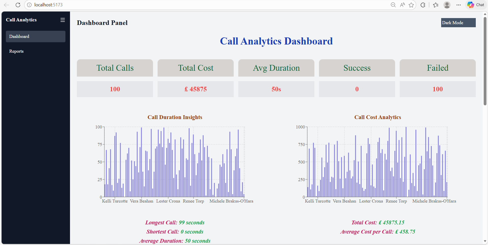
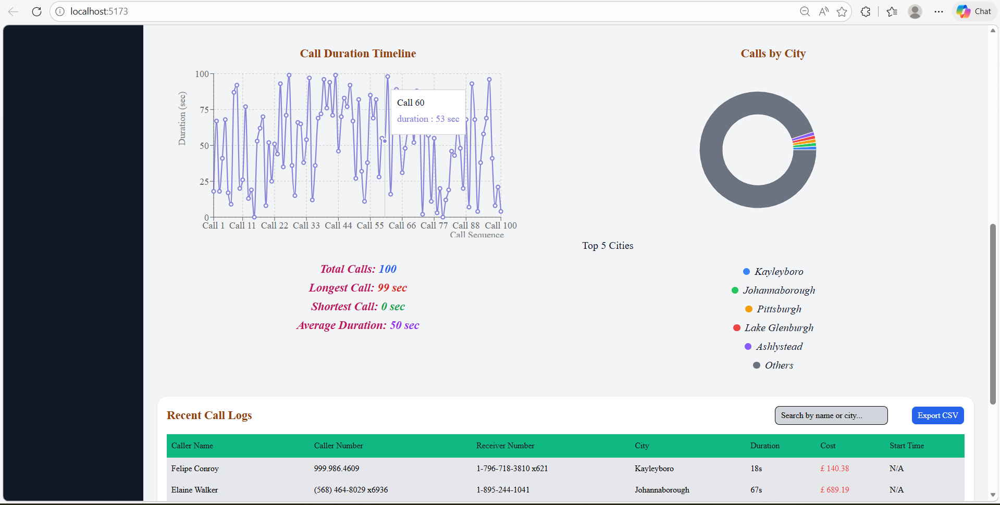
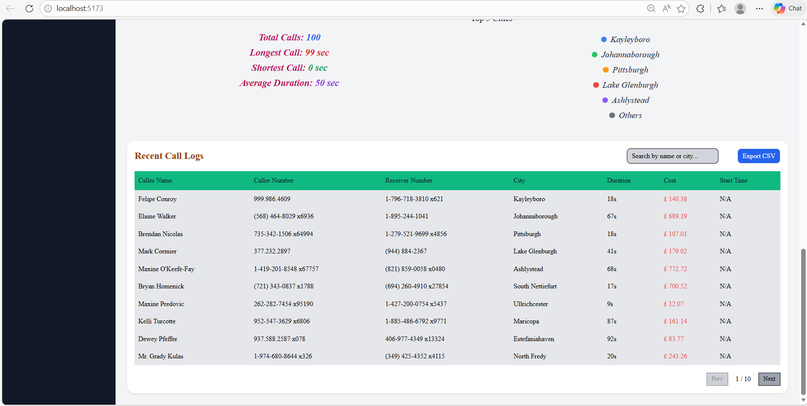

# Call Analytics Dashboard

## Project Description
The Call Analytics Dashboard is a React-based web application that allows users to monitor and analyze call logs in real time. Users can:

- View total calls, total cost, average duration, and success/failure metrics.
- Filter calls by caller name.
- Visualize data through interactive charts (Duration, Cost, Timeline, City).
- Export call logs as a CSV file.

This dashboard is perfect for businesses or teams that need to track call performance efficiently.

---

## Technology Stack

- **Frontend:** React, TailwindCSS
- **Charts:** Chart.js / Recharts
- **Data Handling:** JavaScript
- **Deployment:** Vercel
- **Version Control:** Git & GitHub

---

## Screenshots

### Dashboard Overview





---

## Features

- KPI Cards (Total Calls, Total Cost, Average Duration, Success, Failed)
- Interactive Charts:
  - Duration Chart
  - Cost Chart
  - Timeline Chart
  - City Distribution Chart
- Search and Filter Calls by Caller Name
- CSV Export of Filtered Calls
- Responsive Design for Mobile and Desktop

---

## Deployment

The live dashboard is deployed on Vercel:  
https://call-analytics-dashboard-woad.vercel.app/


---

## Installation and Running Locally

1. Clone the repository:

```bash

